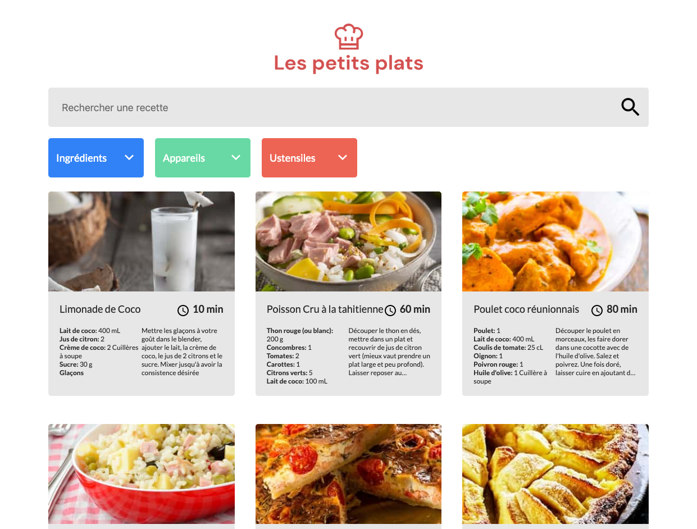
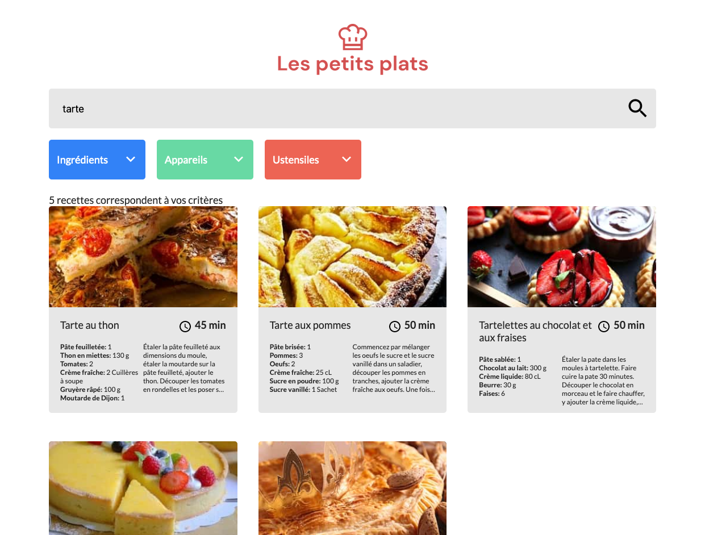
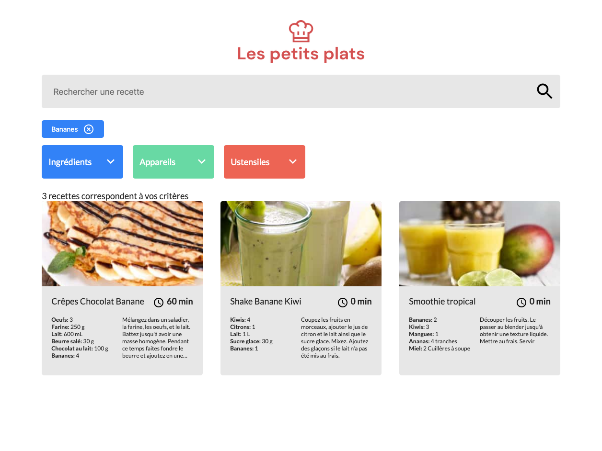

# Les petits plats

Projet n°7 du [parcours Développeur d'Application - JavaScript React](https://openclassrooms.com/fr/paths/516-developpeur-dapplication-javascript-react) d'OpenClassrooms : _Développez un algorithme de recherche en JavaScript_.

> On nous demande d'intégrer les maquettes fournies. Il faudra ensuite proposer deux algorithmes de recherche et tester leurs performances afin de recommander le plus performant des deux.

## 📚 Technologie utilisées

- HTML
- Sass
- JavaScript

## 📎 Rendu visuel

## 💻 Démo du site

[Les petits plats](https://clementstorne.github.io/Les-petits-plats/)
